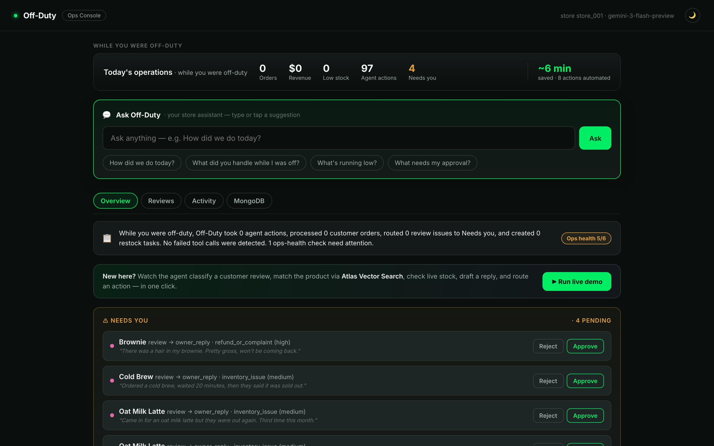
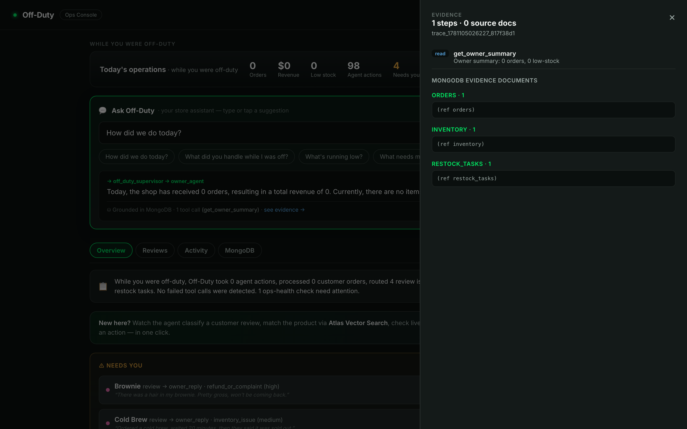
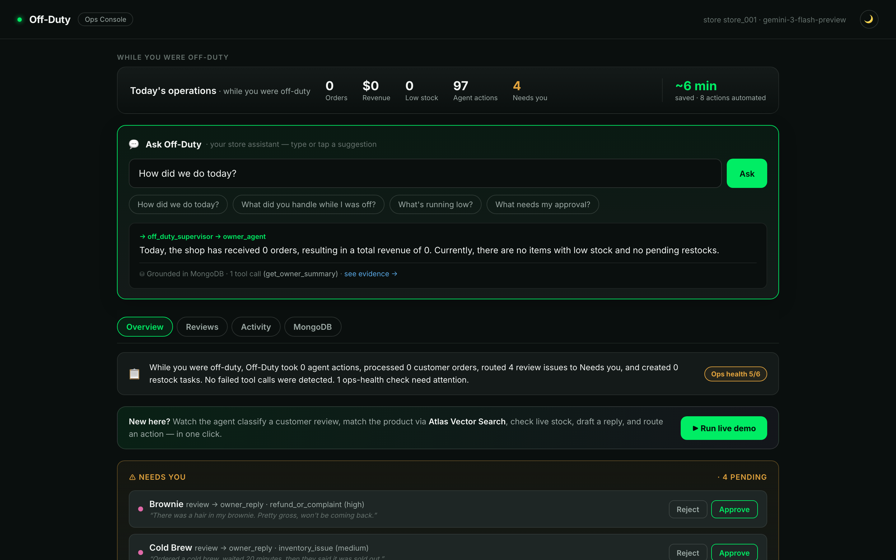
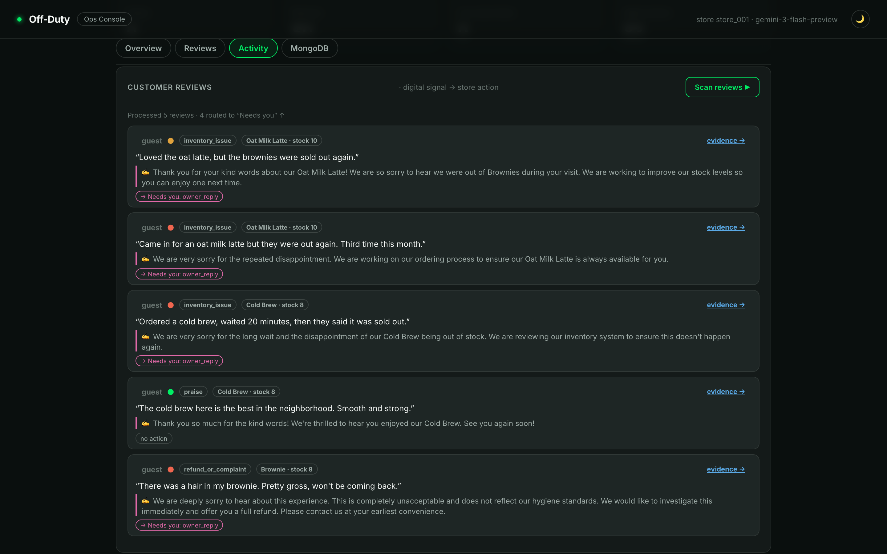
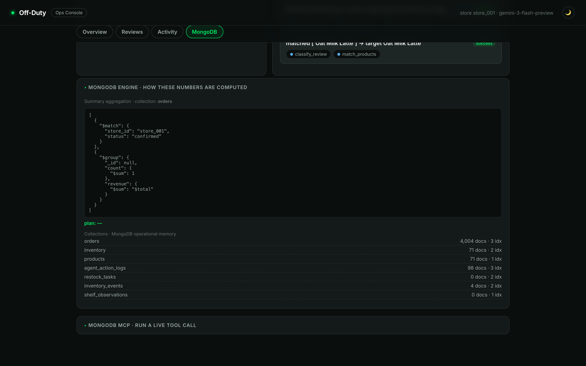
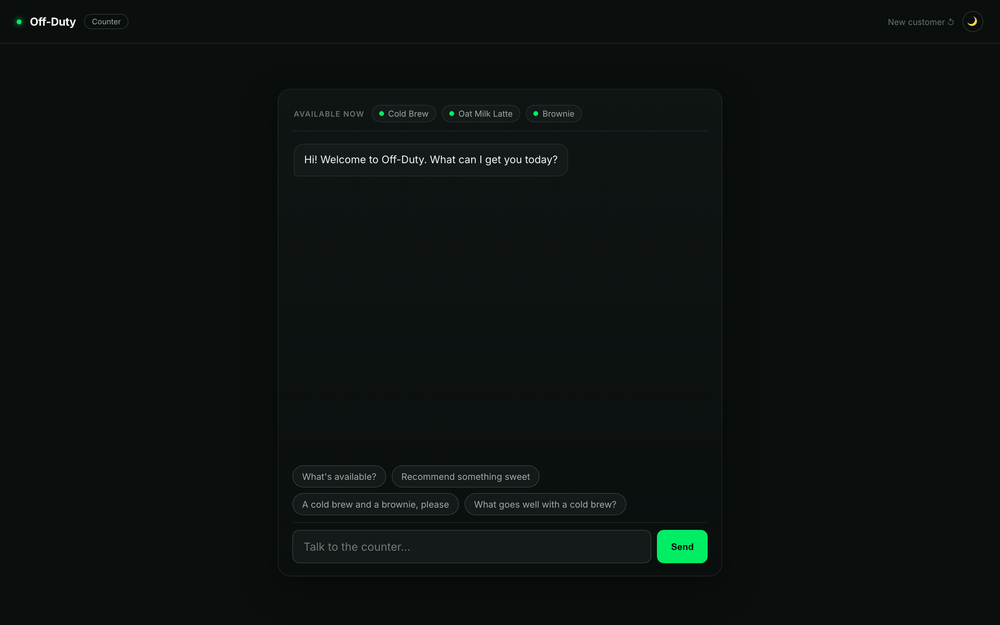
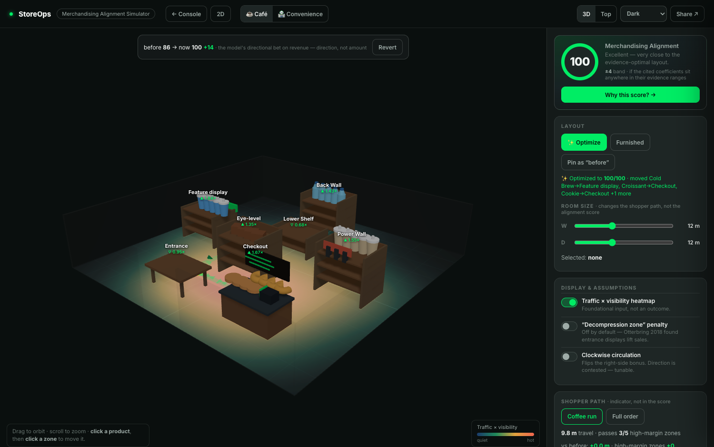

# Off-Duty — an inventory-aware AI store manager for offline shops

The owner is off duty; the agent runs the store, and proves every action in MongoDB. A multi-agent app built with Google ADK and Gemini 3 on Vertex AI over MongoDB Atlas, for the Google Cloud Rapid Agent Hackathon (MongoDB track).

    



<details>
<summary>More screens</summary>

**Evidence drawer** — trace any action back to the real MongoDB documents it touched


**Grounding receipt** — every answer links to the evidence it used


**Review-to-Action** — classify a review, match the product via Atlas Vector Search, route an action


**MongoDB engine** — the live aggregation pipeline and query plan


**Customer Counter** — availability-grounded ordering


</details>

* * *

## How it works

```
customer / owner  ->  supervisor (Gemini 3)  ->  ordering / inventory / vision / owner agent  ->  MongoDB Atlas
                                             \->  MongoDB MCP server (live, read-only)
                                             \->  agent_action_logs  (evidence trail, by trace_id)
```

The supervisor delegates by intent, not keywords. Every read, write, and recommendation is auto-logged to `agent_action_logs` with a `trace_id`, so the owner can audit the whole chain back to the source documents.

* * *

## Key features

- **Streaming agent trace** — the owner asks in plain language and watches the live delegation path, then gets a **MongoDB grounding receipt** linked to the exact evidence.
- **Review-to-Action** — one click reads a customer review, matches the product with **Atlas Vector Search**, checks live stock, drafts a reply, and routes an action.
- **Store-State vision** — a shelf photo, read by Gemini, matched to products in MongoDB.
- **Human in the loop** — every write waits in a "Needs you" inbox to approve, reject, or undo.
- **Evidence drawer** — any action traces back to the real MongoDB documents it touched.
- **Daily report + reconciliation** — an end-of-day summary plus six data-integrity checks.

* * *

## Merchandising layout simulator

The app also ships a self-contained **3D merchandising simulator** (`app/static/layout3d.html`, or `/layout3d`) — plan a store layout before rearranging, and get a **0–100 alignment score** that decomposes, in a "Why this score?" drawer, into cited retail-marketing research. Full write-up → [app/static/merch/README.md](app/static/merch/README.md).



- **0–100 alignment score**, every point traced to a real study — eye-level (Drèze 1994 / Chandon 2009), endcap lift (Nakamura 2014), checkout impulse (Ejlerskov 2018), adjacency (Bezawada 2009), facings (Eisend 2014), entrance exposure (Otterbring 2018, which debunks the "decompression zone"), shopper travel (Hui 2013 / Larson 2005).
- **"Make it MY store"** editable product economics · **coefficient sensitivity band** (86 ±5) with robust/sensitive advice · **grounded shopper path** with a travel-distance indicator.
- **Honest by design** — no revenue prediction; it's an alignment index, not a sales model.
- **Verified** — `cd verify && npm run verify`: 1,360 property trials + geometry proofs (the UI and the checkers import the same `model.js`).

* * *

## Why MongoDB

| Capability | Where it runs |
|---|---|
| Aggregation pipelines with `explain` query plans | owner summary, digest, daily report, reconciliation |
| **Atlas Search** (`$search`) + **Vector Search** (`$vectorSearch`, Gemini 768-dim) + RRF hybrid | product matching in vision, ordering, review-to-action |
| `agent_action_logs` evidence trail (`trace_id` + `collection:id` refs) | Evidence drawer, grounding receipt |
| **MongoDB MCP server**, live and read-only, every call logged | `POST /api/mcp-proof` and the console button |

* * *

## Security (Well-Architected aligned)

Reviewed against the Google Cloud Well-Architected Framework, Security pillar.

- **Secrets out of code** — no credentials in the repo or images; `.env` is git-ignored, only `*.env.example` is committed.
- **Identity without keys** — Vertex AI via Application Default Credentials, a service account scoped to `aiplatform.user`.
- **Least privilege** — the MongoDB user is scoped to the app database; the MCP server is read-only.
- **Use AI responsibly** — answers are grounded in tool results, every action is auditable by `trace_id`, and every write is gated behind human approval.

* * *

## Quickstart

```bash
# zero-setup: the whole app on canned data, no credentials
pip install -r app/requirements.txt
MOCK_MODE=true python -m uvicorn app.main:app --port 8080
# open http://localhost:8080  and  http://localhost:8080/counter
```

```bash
# live: MongoDB Atlas + Vertex
gcloud auth application-default login
cp app/.env.example app/.env            # set MONGODB_URI
python scripts/reset_demo.py --snapshot
python -m uvicorn app.main:app --port 8080
```

Reliability: `python scripts/run_demo_checks.py` (golden checks, 10/10). Eval pack: `python scripts/run_eval_golden.py`. See [DEMO_SCRIPT.md](DEMO_SCRIPT.md) for the 3-minute walkthrough.

* * *

## Tech stack


       

* * *

## Project layout

```text
app/        FastAPI + ADK agents (supervisor + ordering/inventory/vision/owner + mcp_agent)
  core/     product_search ($search/$vectorSearch/RRF), audit (evidence trail), mcp
  flows/    owner_read (summary/timeline/evidence/daily report/reconcile), review_to_action
  static/   console.html (Ops Console) · counter.html (Customer Counter) · layout.html (2D)
            layout3d.html (merchandising simulator) · merch/model.js (scoring + routing model)
verify/     mechanical checks for the simulator model — `cd verify && npm run verify`
scripts/    run_demo_checks.py · run_eval_golden.py · prepare_review_seed.py · reset_demo.py
tests/e2e/  Playwright suite for the web UIs
Dockerfile  Cloud Run source build (Python + Node for the MongoDB MCP server)
```
